# 💄 Lumière — Skincare Product Recommender System

<div align="center">


**An end-to-end Item-Item Collaborative Filtering recommender system built on 487,057 Sephora skincare reviews, featuring a luxurious interactive web dashboard.**

[🚀 Quick Start](#-quick-start) · [📊 Dataset](#-dataset) · [🧠 Algorithm](#-algorithm) · [📈 Results](#-results) · [🖥️ Dashboard](#️-lumière-dashboard) · [📁 Project Structure](#-project-structure)

</div>

---

## 🌟 Overview

**Lumière** is a full-pipeline recommender system for skincare products, leveraging real-world user reviews from Sephora's platform. The system ingests over **1 million raw reviews**, cleans and filters them, and applies a bias-corrected **Item-Item Collaborative Filtering** algorithm with **Pearson correlation** similarity to generate personalised top-5 product recommendations for **30,034 users**.

The results are served through a stunning, standalone HTML dashboard — **Lumière** — that lets anyone explore insights and look up personalised recommendations directly in their browser.

### Key Highlights

| Metric | Value |
|---|---|
| 📝 Raw reviews processed | 1,094,411 |
| ✅ Reviews after filtering | 487,057 |
| 👤 Unique users | 92,132 |
| 🧴 Unique products | 1,865 |
| 🤖 Users with recommendations | 30,034 |
| 🎯 Recommendations generated | 150,170 |
| ⭐ Global mean rating | 4.36 |
| 📉 CF RMSE vs Baseline | 0.7821 vs 0.7901 (+1.0% improvement) |
| 💰 Average product price | $52.78 |

---

## 📁 Project Structure

```
recommender-system-sushi/
│
├── 📓 1-Data-Preprocessing-and-Merging-FIXED.ipynb   # Step 1: ETL pipeline
├── 📓 2-Recommender-System-FIXED.ipynb               # Step 2: CF algorithm
├── 🌐 skincare-dashboard.html                        # Interactive dashboard
│
├── screenshots/                                      # README screenshots
│
├── input/                                            # Raw data (not tracked)
│   ├── product_info.csv                              # 8,494 Sephora products
│   ├── reviews_0-250.csv                             # Reviews, split by range
│   ├── reviews_250-500.csv
│   ├── reviews_500-750.csv
│   ├── reviews_750-1250.csv
│   └── reviews_1250-end.csv
│
└── output/                                           # Generated artifacts
    ├── merged_data.csv          # 487K clean reviews (~50 MB)
    ├── data_summary.json        # Dataset statistics
    ├── product_mapping.json     # Product ID ↔ index mappings
    ├── recommendations.json     # Top-5 recs per user (~36 MB)
    ├── recommendations_full.csv # Flat recommendation table
    ├── product_catalog.csv      # Product catalog with avg ratings
    ├── top_products.json        # Top 20 highest-rated products
    ├── dashboard_stats.json     # Dashboard KPIs
    └── item_sim.json            # Top-20 similar products per item
```

---

## 📊 Dataset

The project uses the **[Sephora Products and Skincare Reviews](https://www.kaggle.com/datasets/nadyinky/sephora-products-and-skincare-reviews)** dataset from Kaggle.

### Input Files

| File | Rows | Description |
|---|---|---|
| `product_info.csv` | 8,494 | Product metadata: name, brand, price, category |
| `reviews_0-250.csv` | 602,130 | User reviews (batch 1) |
| `reviews_250-500.csv` | 206,725 | User reviews (batch 2) |
| `reviews_500-750.csv` | 116,262 | User reviews (batch 3) |
| `reviews_750-1250.csv` | 119,317 | User reviews (batch 4) |
| `reviews_1250-end.csv` | 49,977 | User reviews (batch 5) |
| **Total** | **1,094,411** | |

---

## 📓 Notebook 1 — Data Preprocessing & Merging

**File:** `1-Data-Preprocessing-and-Merging-FIXED.ipynb`

This notebook handles the full ETL (Extract, Transform, Load) pipeline — from raw CSV files to a clean, analysis-ready dataset.

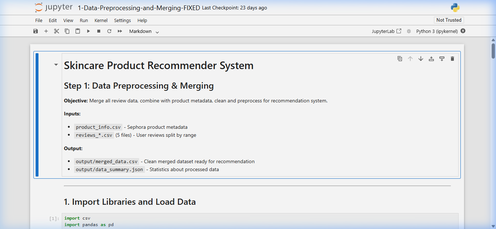

### Step 1: Load Data

Reads `product_info.csv` (8,494 products, 27 columns) and all 5 review CSV files. After concatenation: **1,094,411 total reviews** across 18 columns.

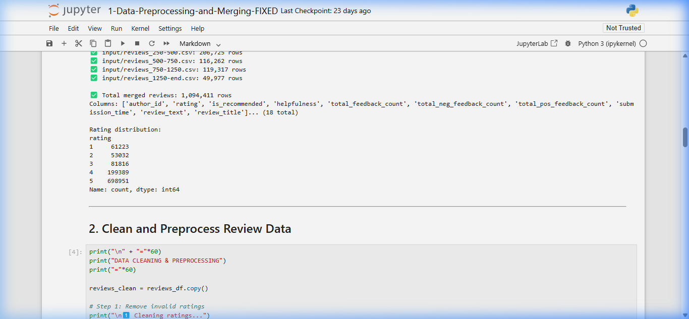

### Step 2: Clean Reviews

| Operation | Before | After |
|---|---|---|
| Remove invalid ratings | 1,094,411 | 1,094,411 |
| Remove duplicate (user, product) pairs | 1,094,411 | 1,088,891 |
| Select essential columns | 18 cols | 6 cols |

### Step 3: Filter Sparse Interactions

To ensure sufficient data for similarity computation, sparse users and products are removed:

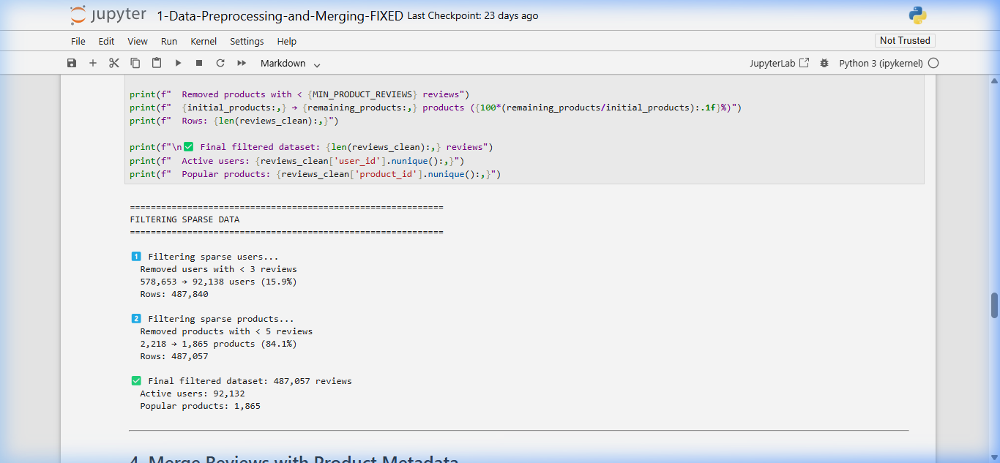

| Filter | Before | After |
|---|---|---|
| Users with **≥ 3** reviews | 578,653 users | 92,138 users (15.9%) |
| Products with **≥ 5** reviews | 2,218 products | 1,865 products (84.1%) |
| **Total rows** | 1,088,891 | **487,057** |

### Step 4: Merge & Export

Left-joins reviews with product metadata on `product_id`, then exports the clean dataset. Final statistics and the rating breakdown per star:

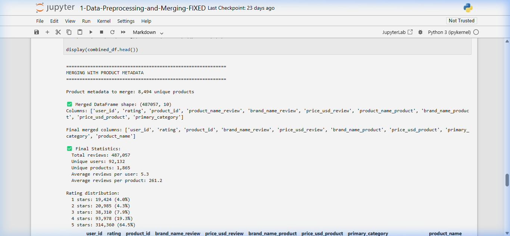

---

## 📓 Notebook 2 — Collaborative Filtering Recommender System

**File:** `2-Recommender-System-FIXED.ipynb`

### Step 1: Build User-Item Matrix

35% of users (30,034 out of 85,812) are randomly sampled with seed `42`, while all 1,865 products are used for a stable similarity matrix. The result is a sparse CSR matrix:

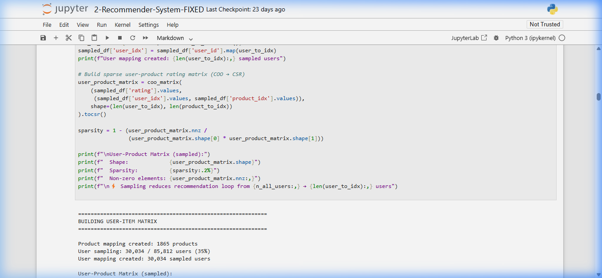

| Matrix Property | Value |
|---|---|
| Shape | 30,034 × 1,865 |
| Sparsity | 99.70% |
| Non-zero elements | 170,757 |

### Step 2: Compute Item-Item Similarity (Pearson)

Pearson correlation is computed as **cosine similarity on mean-centered rating vectors**. A co-rater threshold (`MIN_CORATERS = 3`) zeros out similarities with too few shared raters.

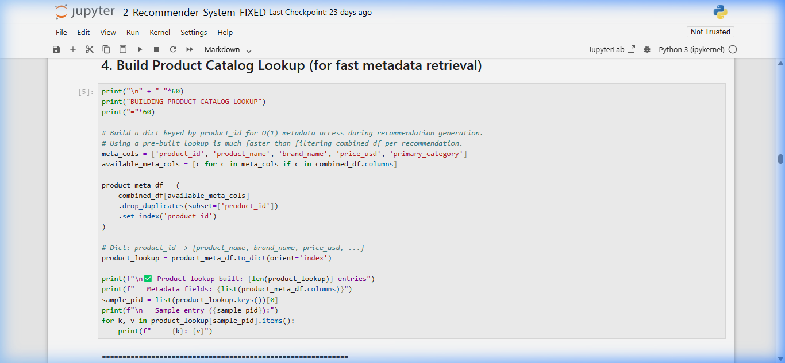

| Similarity Stats | Value |
|---|---|
| Matrix shape | 1,865 × 1,865 |
| Pairs zeroed by co-rater filter | 3,286,214 |
| Remaining non-zero pairs | 189,344 |
| Positive pairs | 138,252 |
| Range | [-0.1495, +1.0000] |

### Step 3: RMSE Evaluation (80/20 Train-Test Split)

A held-out test validates that Item-Item CF meaningfully outperforms a pure baseline:

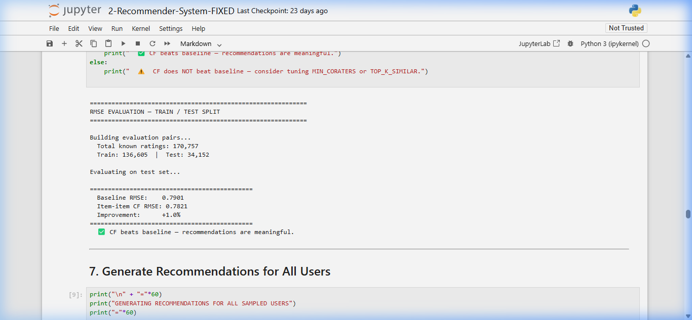

| Method | RMSE |
|---|---|
| Baseline (μ + user bias + product bias) | 0.7901 |
| **Item-Item CF** | **0.7821** |
| **Improvement** | **+1.0% ✅** |

### Step 4: Generate & Display Recommendations

150,170 recommendations are generated for all 30,034 sampled users. Sample output below:

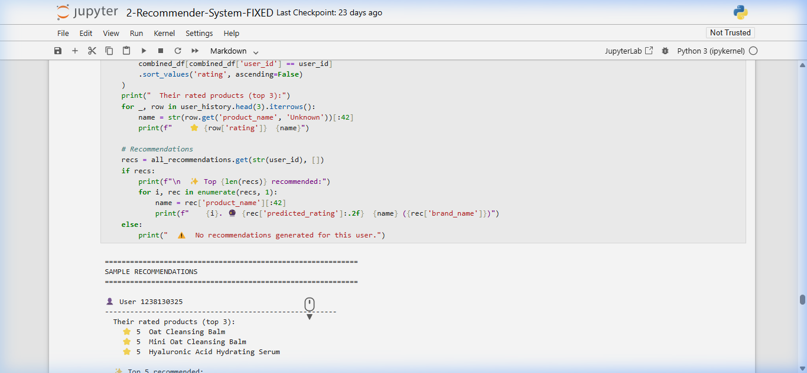

### Step 5: Export All Output Files

All recommendation data and dashboard files are exported:

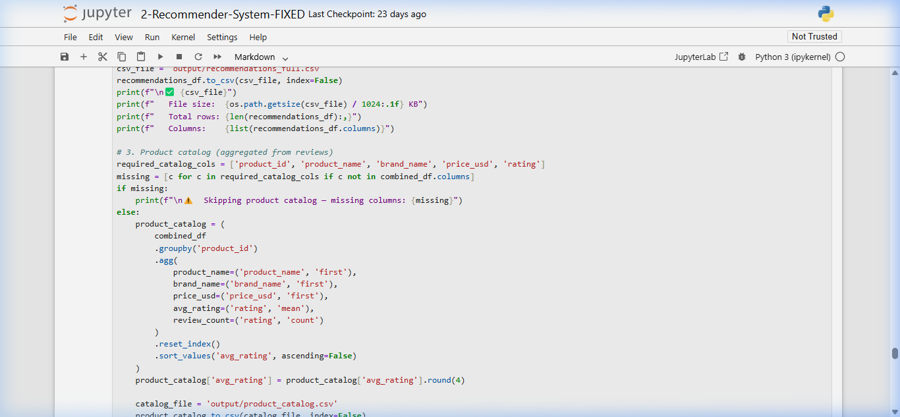

---

## 🧠 Algorithm

### Item-Item CF with Bias-Corrected Prediction

The predicted rating for user `u` on item `i` is:

```
pred(u, i) = b(u,i) + Σ[ sim(i,j) · (r(u,j) − b(u,j)) ] / Σ sim(i,j)
```

where the **baseline estimate** is:

```
b(u, i) = μ  +  bias_user(u)  +  bias_product(i)
```

- **μ** = global mean rating (4.3654)
- **bias_user(u)** = user's mean deviation from global mean
- **bias_product(i)** = product's mean deviation from global mean

**Key design choices:**
- Only **positive-similarity neighbors** (`sim > 0`) are used
- Top **K = 10** neighbors selected per candidate product
- Predictions clipped to valid range **[1.0, 5.0]**
- **Co-rater threshold**: similarities from fewer than 3 shared raters are zeroed out
- **Popularity dampening** (α = 0.8) re-ranks each user's top-5 to improve personalisation

### Why Pearson over Cosine?

Pearson corrects for **rating scale bias** — lenient users who rate everything 5★ vs. critical users who rate everything 3★. Mean-centering each product's rating vector before computing cosine similarity normalises these biases automatically.

---

## 📈 Results

### Sample Recommendations

**User 1238130325** (rated: Oat Cleansing Balm ⭐5, Mini Oat Cleansing Balm ⭐5, Hyaluronic Acid Serum ⭐5)

| Rank | Product | Brand | Predicted Rating |
|---|---|---|---|
| 1 | Superfood Antioxidant Cleanser | Youth To The People | 5.00 ⭐ |
| 2 | Green Clean Makeup Meltaway Cleansing Balm | Farmacy | 5.00 ⭐ |
| 3 | Green Clean Makeup Removing Cleansing Balm | Farmacy | 5.00 ⭐ |
| 4 | Ultra Repair Cream Intense Hydration | First Aid Beauty | 5.00 ⭐ |
| 5 | Alpha Beta Extra Strength Daily Peel Pads | Dr. Dennis Gross | 5.00 ⭐ |

**User 27991208736** (rated: Daily Microfoliant Exfoliator ⭐5, All About Clean Liquid Facial Soap ⭐5)

| Rank | Product | Brand | Predicted Rating |
|---|---|---|---|
| 1 | 7 Day Face Scrub Cream Rinse-Off Formula | CLINIQUE | 5.00 ⭐ |
| 2 | Skin Smoothing Cream Moisturizer | Dermalogica | 5.00 ⭐ |
| 3 | Clearly Clean Makeup Removing Cleansing Balm | Farmacy | 5.00 ⭐ |
| 4 | Truth Barrier Booster Orange Ferment Vitamin C | OLEHENRIKSEN | 5.00 ⭐ |
| 5 | Wake Up Honey Eye Cream with Brightening Vitamins | Farmacy | 5.00 ⭐ |

---

## 🖥️ Lumière Dashboard

The project ships with `skincare-dashboard.html` — a fully standalone, client-side interactive dashboard with zero build dependencies.

### Hero Section

The dashboard opens with live key statistics pulled from `output/dashboard_stats.json`:


### Overview Section

Eight KPI cards covering total reviews, unique users, products, mean rating, total recommendations generated, average predicted rating, average price, and recommendation coverage:


### Data Insights — Charts

Two interactive Chart.js visualisations: **Rating Distribution** (bar chart) and **Top Brands by Review Volume** (horizontal bar chart):

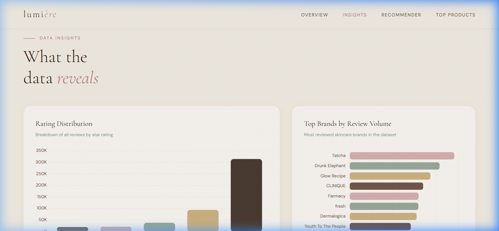

### Personal Recommender

Enter any User ID to retrieve their personalised Top-5 recommendation cards:


### Top Products Table

Ranked table of the community's highest-rated products with brand, rating, review count, and price:

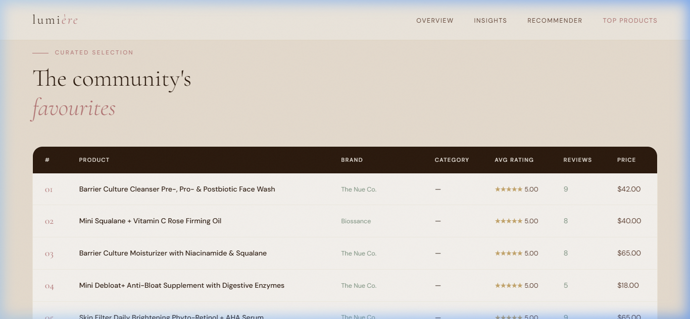

### Running the Dashboard

The dashboard fetches the `output/` files at runtime, so it **must be served from a local HTTP server**:

```bash
# Python (recommended)
python -m http.server 9090
# Then open: http://localhost:9090/skincare-dashboard.html
```

---

## 🚀 Quick Start

### Prerequisites

```bash
pip install pandas numpy scipy scikit-learn jupyter
```

### 1. Clone the repository

```bash
git clone https://github.com/<your-username>/skincare-recommender-lumiere.git
cd skincare-recommender-lumiere
```

### 2. Add raw data

Download from [Kaggle](https://www.kaggle.com/datasets/nadyinky/sephora-products-and-skincare-reviews) and place in `input/`:

```
input/
├── product_info.csv
├── reviews_0-250.csv
├── reviews_250-500.csv
├── reviews_500-750.csv
├── reviews_750-1250.csv
└── reviews_1250-end.csv
```

### 3. Run Notebook 1 — Preprocessing

```bash
python -m jupyter notebook "1-Data-Preprocessing-and-Merging-FIXED.ipynb"
```

Run all cells → generates `output/merged_data.csv` and supporting JSON files.

### 4. Run Notebook 2 — Recommender

```bash
python -m jupyter notebook "2-Recommender-System-FIXED.ipynb"
```

Run all cells → generates all recommendation and dashboard files.

> ⏱️ **Expected runtime:** ~10–20 minutes (matrix operations on 30K × 1,865 arrays).

### 5. Launch the Dashboard

```bash
python -m http.server 9090
```

Open [http://localhost:9090/skincare-dashboard.html](http://localhost:9090/skincare-dashboard.html)

---

## ⚙️ Configuration

Key hyperparameters tunable in **Notebook 2**:

| Parameter | Default | Description |
|---|---|---|
| `USER_SAMPLE_FRAC` | `0.35` | Fraction of users in the CF matrix |
| `RANDOM_SEED` | `42` | Seed for reproducible user sampling |
| `MIN_CORATERS` | `3` | Min shared raters for a valid product-pair similarity |
| `TOP_K_SIMILAR` | `10` | Max positive neighbors per candidate product |
| `TOP_N_RECOMMENDATIONS` | `5` | Recommendations per user |
| `POPULARITY_ALPHA` | `0.8` | Popularity dampening strength (0=off, 1=strong) |

Key thresholds in **Notebook 1**:

| Parameter | Default | Description |
|---|---|---|
| `MIN_USER_REVIEWS` | `3` | Min reviews a user must have |
| `MIN_PRODUCT_REVIEWS` | `5` | Min reviews a product must have |

---

## 📦 Output Files Reference

| File | Size | Description |
|---|---|---|
| `output/merged_data.csv` | ~50 MB | Clean merged dataset (487,057 rows × 9 cols) |
| `output/data_summary.json` | 1 KB | Dataset statistics |
| `output/product_mapping.json` | 83 KB | product_id ↔ integer index mappings |
| `output/recommendations.json` | ~36 MB | Top-5 recs per user with metadata |
| `output/recommendations_full.csv` | ~12 MB | Flat recommendations table (150,170 rows) |
| `output/product_catalog.csv` | 143 KB | All 1,865 products with avg_rating and review_count |
| `output/top_products.json` | 4 KB | Top 20 highest-rated products |
| `output/dashboard_stats.json` | 1 KB | Aggregated KPIs for the dashboard |
| `output/item_sim.json` | 448 KB | Top-20 similar products per product |

---

## 🛠️ Dependencies

| Library | Purpose |
|---|---|
| `pandas` | Data loading, cleaning, and export |
| `numpy` | Matrix operations and vectorised computation |
| `scipy` | Sparse matrix construction (`coo_matrix` → `csr_matrix`) |
| `scikit-learn` | `cosine_similarity`, `train_test_split` for RMSE eval |
| `jupyter` | Notebook execution environment |

Dashboard (CDN, no install needed):
- [Chart.js 4.4](https://www.chartjs.org/) — Interactive charts
- [Google Fonts](https://fonts.google.com/) — Cormorant Garamond + DM Sans

---

## 📄 License

Released under the **MIT License**. The Sephora dataset is subject to its own [Kaggle dataset terms](https://www.kaggle.com/datasets/nadyinky/sephora-products-and-skincare-reviews).

---

## 🙏 Acknowledgements

- **Dataset:** [Nadia Yakovska — Sephora Products and Skincare Reviews (Kaggle)](https://www.kaggle.com/datasets/nadyinky/sephora-products-and-skincare-reviews)
- **Algorithm reference:** Koren, Y. (2010). *Factor in the Neighbors: Scalable and Accurate Collaborative Filtering*. ACM TKDD.

---

<div align="center">
  <sub>Built with ❤️ · Item-Item Collaborative Filtering · Pearson Correlation · Sephora Skincare Reviews</sub>
</div>
